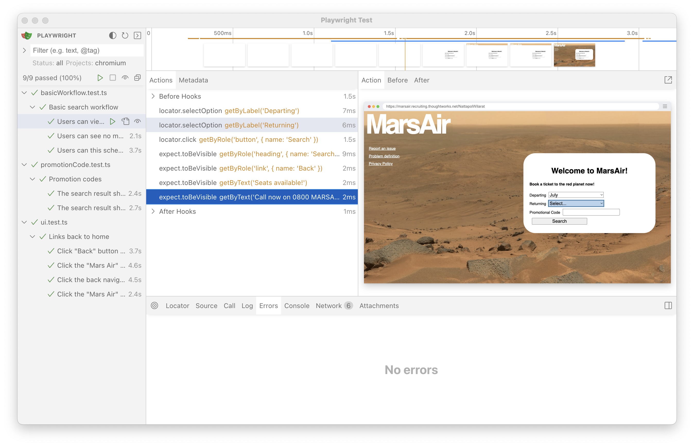
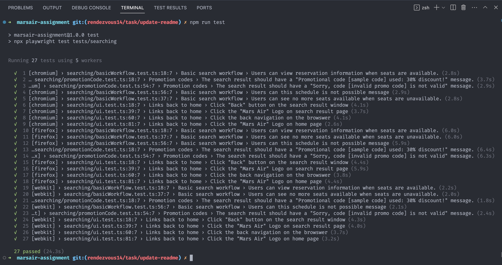

# marsair-assignment

Mars Airlines Assignment

End-to-end testing powered by [playwright](https://github.com/microsoft/playwright) with typescript

## Setup

### 0. Require Nodejs to setup this project

Recommended to use asdf-vm and plugin NodeJS. See more detail by this link [asdf-vm-nodejs](https://asdf-vm.com/guide/getting-started.html#install-the-plugin)
```
asdf install nodejs 20.5.1
```

### 1. Clone the project

```
git clone https://github.com/rendezvous14/marsair-assignment.git
```

### 2. install dependencies

```
npm install
npx playwright install
```

### 3. set up environment variables

Copy file from [1PW](https://share.1password.com/s#q7_-X-zpCucIaox2-IrgtdUHyeYIR0syEzETxW-56H8)
and paste it into `.env` file on the project directory

## playwright run with different option

### playwright run open mode on specific test

Use VS Code with [Playwright Test for VSCode](https://playwright.dev/docs/getting-started-vscode):

1. Select Testing tab
2. Select test case that you want to run

   - Click Debug to run specific test with browser open. You can set breakpoint and step through code as well
   - Click Run to run specific test in headless mode

### playwright run with ui mode

```
$ npm run test-ui
```

#### output



### playwright run headless mode

```
$ npm run test
```

#### output



### playwright generate html report

```
$ npm run report
```

## Test structures

### tests directory

keep all test cases which are separated by features

```
tests
└── searching
    ├── basicWorkflow.test.ts
    ├── promotionCode.test.ts
    └── ui.test.ts
```

### src directory

keep all the resources e.g. constants, services, pages (POM), utils, helper

```
src
├── constants
│   └── searchOptions.ts
└── pages
    ├── home.page.ts
    └── searchResult.page.ts
```
